# About the scripts
*These scripts provide dual colors for RGB rings around the gimbals and the RGB switches on some radios like the Radiomaster TX15/TX16S MK3*

**Scripts**

*There are 8 pre made scripts named the following way: LeftColorRightColor.lua, but each color was shorten due to file name size restriction*
- CyPk.lua     (Cyan Pink)


- GrnPk.lua     (Green Pink)


- GrnWte.lua    (Green White)
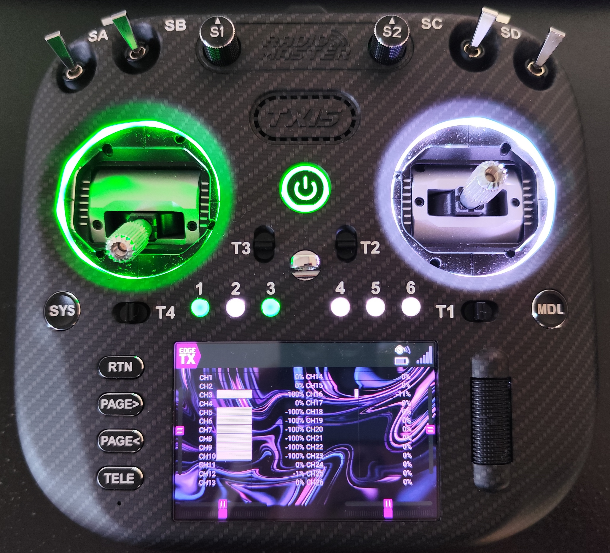

- LimMag.lua    (Lime Magenta)


- OrngBlu.lua   (Orange Blue)
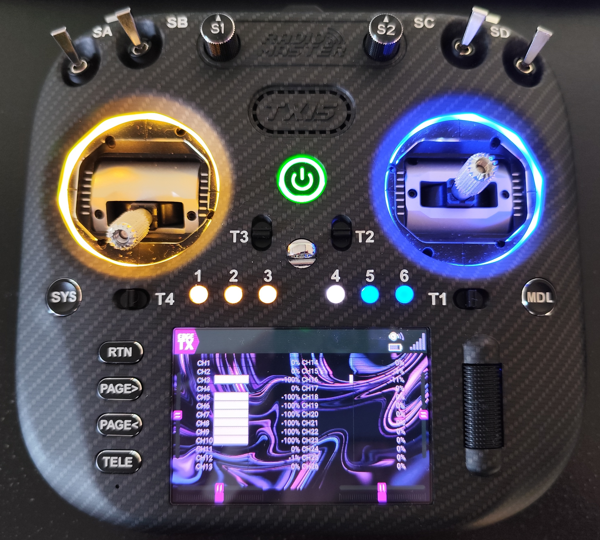

- PrplWte.lua   (Purple White)
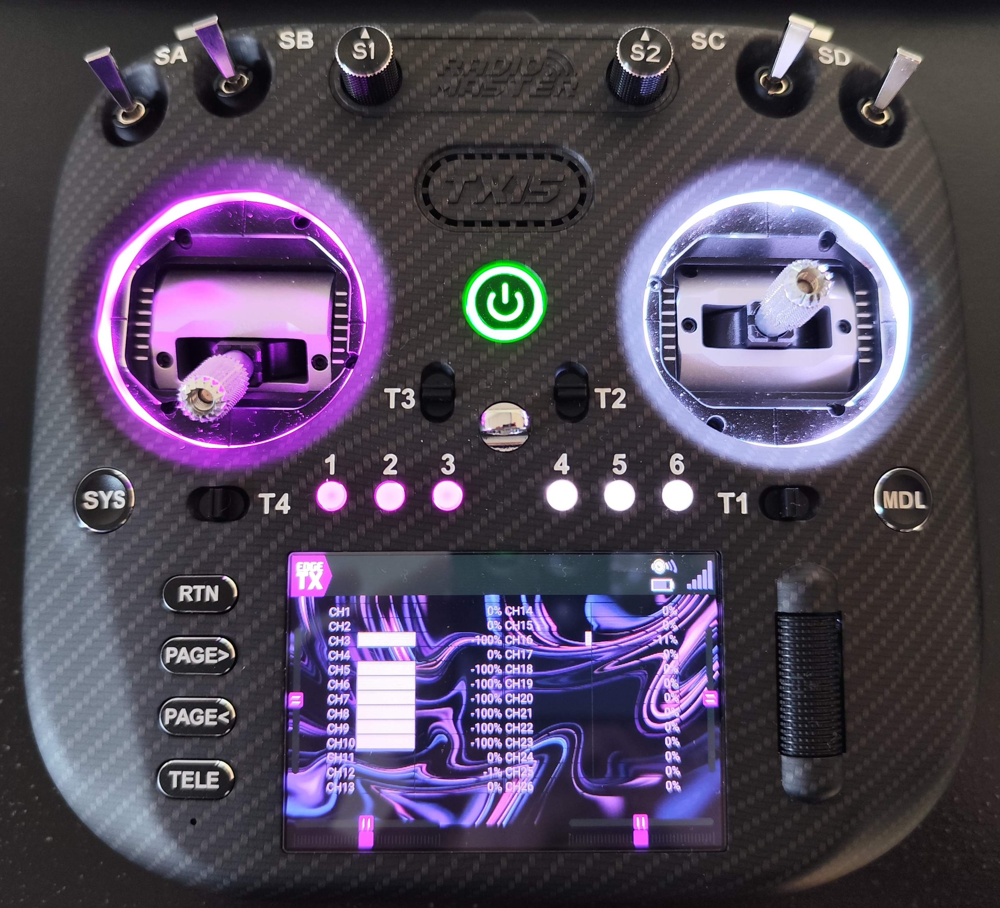

- RedCy.lua     (Red Cyan)


- RedWte.lua    (Red White)


**Colors**

The file colors.txt contain the list of the base colors that can be set to the RGB rings/RGB switches if you want to make your own color combinations.


# Compatibility

- Radiomaster TX15 Max
- Radiomaster TX16S MK3

*These scripts have been tested with EdgeTX 2.12.0-RC1 on the Radiomaster TX15 Max.*

*They have also been tested on the 3.0.0 version (stock firmware for the TX15) and the pre-2.12.0 (stock firmware for the TX16S MK3)*

Thanks to KStacy who tested the scripts on his TX16S MK3 !

# Installation

- Copy the content of the ```scripts``` folder into the ```/SCRIPTS/RGBLED/``` folder on your SD card.

- Go in the *Model Settings tab*
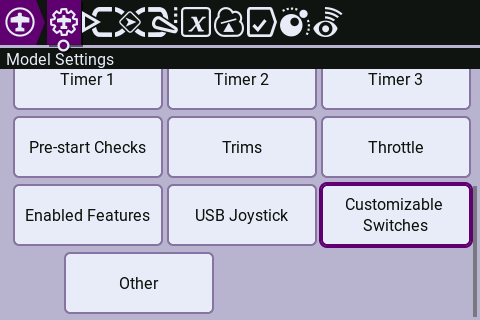

- In the *Customizable Switches* set the names/types/groups as you want and check the *Allow Lua override* on OFF and set the ON color to whatever you like.
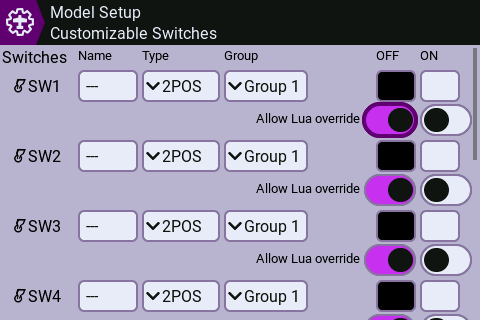

- Then go in the *Special Functions* tab
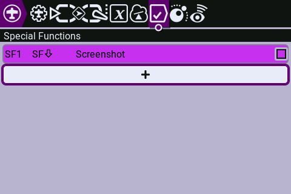

- Create a new special function
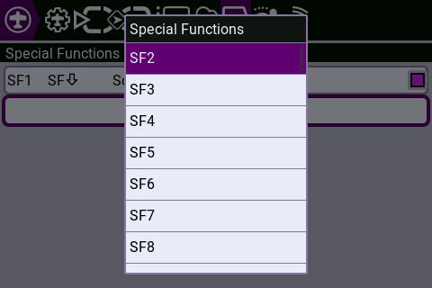

- Set the trigger to the switch you want (I use the RGB switches SF1 ~ SF6)
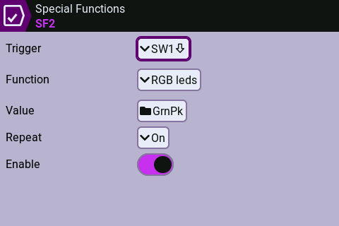

- Set the function to *RGB leds*
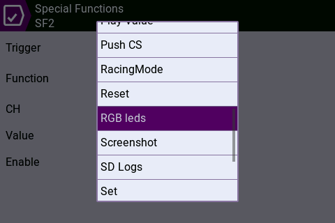

- Set the value to the colors that you want
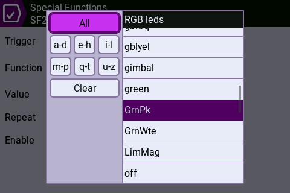

- Set the repeat to 1x
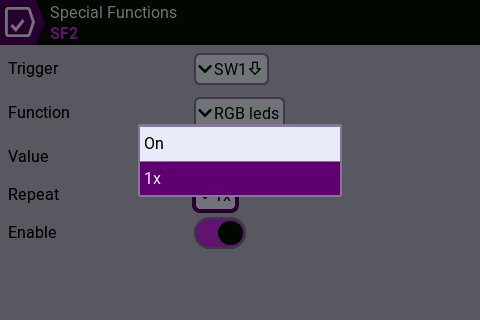

- Check the Enable toggle
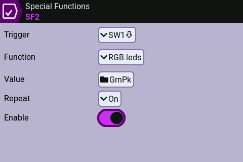

# Package
*These are the files contained in the release*

```
Package
├─ scripts
│  ├─ CyPk.lua
│  ├─ GrnPk.lua
│  ├─ GrnWte.lua
│  ├─ LimMag.lua
│  ├─ OrngBlu.lua
│  ├─ PrplWte.lua
│  ├─ RedCy.lua
│  └─ RedWte.lua
├─ colors.txt
├─ LICENSE
└─ README.md
```

# Versions

**v2.2.0**
- Added a new color scheme (Cyan Pink)


**v2.1.0**
- Added a tutorial to set everything properly


**v2.0.0**
- Added the colors for the RGB switches
- Example images have been added to the readme
- The scripts have been tested on the Radiomaster TX16S MK3


**Initial commit**
- 7 pre made scripts
- .txt file with the list of the available colors